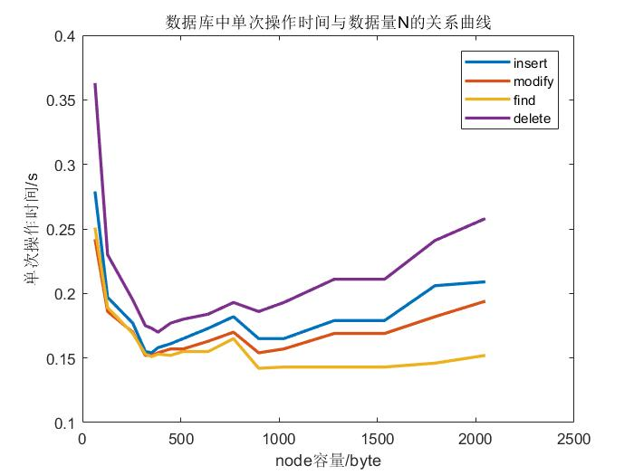
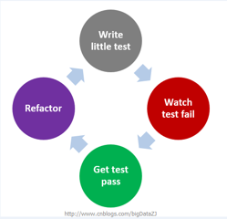

# <center>简易KEY-VALUE型database设计文档</center>

<center>516110910019 谭骁</center>

- [1 基本信息](#基本信息)
- [2 类的设计与接口提供](#类的设计与接口提供)
  - [2.1 类的设计](#类的设计)
    - [DataBase](#database)
    - [BPlusTree](#bplustree)
    - [TreeNode](#treenode)
    - [BuddyManager](#buddymanager)
    - [Buffer](#buffer)
    - [Cache](#cache)
  - [2.2 接口提供](#接口提供)
- [3 模块实现](#模块实现)
- [4 核心功能实现及流程图](#核心功能实现及流程图)
  - [4.1 创建数据库](#创建数据库)
  - [4.2 打开数据库](#打开数据库)
  - [4.3 关闭数据库](#关闭数据库)
  - [4.4 插入数据](#插入数据)
  - [4.5 删除数据](#删除数据)
  - [4.6 修改数据](#修改数据)
  - [4.7 查找数据](#查找数据)
- [5 特点](#特点)
  - [5.1 不定长value](#不定长value)
  - [5.2空间碎片化管理](#空间碎片化管理BuddyManager)
  - [5.3 cache中间件优化](#cache中间件优化)
  - [5.4 buffer中间件优化](#buffer中间件优化)
  - [5.5 DataBase多例类管理](#database多例类管理)
- [6 测试及分析](#测试及分析)
  - [6.1 正确性测试](#正确性测试)
    - [6.1.1 大量数据测试](#大量数据测试)
    - [6.1.2 非寻常测试](#非寻常测试)
    - [6.1.3 综合测试](#综合测试)
  - [6.2 性能测试](#性能测试)
    - [6.2.1 速度性能](#速度性能)
    - [6.2.2 空间性能](#空间性能)
- [7 软件工程与开发特点](#软件工程与开发特点)
  - [7.1 TDD(Test Driven Develop)](#tddtest-driven-develop)
    - [7.1.1TDD的优势](#tdd的优势)
  - [7.2 GIT 版本控制](#git-版本控制)
- [8 待改进(架构层次)](#待改进架构层次)
- [9 致谢](#致谢)

## 1 基本信息

- 项目名称：TyDB

- 主要数据结构： B+树

- 开发环境： VS2017

- 测试环境： 环境：Windows10 17134

  ​		     处理器：Intel(R) Core(TM) i7-8750H CPU @ 2.20GHz 2.21GHz

  ​		      内存：16GB

- 概述： 实现KEY-VALUE型数据库CURD，对于部分功能进行优化

- 编程规范：华为编程规范，采用大驼峰式命名法

- GitHub repo: https://github.com/tx19980520/database

## 2 类的设计与接口提供

虽然本项目仅要求单数据库，但是我们的架构仍旧是多数据库的架构。

数据库框架结构如下<center></center>

<center>1. 数据库整体架构</center>

颜色从绿到橙体现的是速度由快到慢，我们更多的是希望在绿色的部分进行操作，减少在黄色和橙色区域的工作。由于本项目只实现简易KEY-VALUE数据库，我们仅提供\<int(primary key)， string(data)\>，我们的接口模仿mongoose的API进行设计。

### 2.1 类的设计

我们的UML类图如下：

<center>

</center><center>2. 类的设计</center> 


##### DataBase

数据库类，不仅要完成一个数据库应有的操作，作为一个多例类，他能够自行管理自己的各实例，通过实例容器保存实例，并且利用私有构造阻止外部构造，提供static method创造实例，获取实例，这在原有的要求上将我们的数据库项目架构扩大不少，并且可扩展性增强，例如可以存在数据库之间的交互。

##### BPlusTree

BPlusTree类，负责数据库索引工作，实现增删改查，在.idx文件中实现B+树，我们设计TreeNode作为基类，MiddleNode和LeafNode继承TreeNode实现BPlusTree

##### TreeNode

树节点是一个抽象类，我们B+树的实现需要，需要用一个指针指向TreeNode的两个子类LeafNode以及MiddleNode，并且实现两个子类的多态。

- LeafNode负责叶节点的实现，存在一个Array负责储存实际的pos，叶节点相互之间有连接。
- MiddleNode负责中间节点的实现，同一层次的MiddleNode相互连接。

<center></center>

<center>3. 数据文件及其相关节点的设计</center>

- MiddleNode空间规划

首先考虑中间节点，中间节点以一个int（为0）开始作为中间节点的标识，后接一个实际的索引值数量，我们设每一层至多有m个索引值，则至多有m+1个分叉，每个索引值为一个int，每一个分叉为一个int类型的指针，且需拥有指向左右兄弟的两个指针，还需要父亲节点的指针，因而我们一层的容积为2m+6个int，假设我们 一个Node为512字节，则可解得m = 61。

- LeafNode空间规划

考虑叶节点，叶节点以一个int（为0）开始作为中间节点的标识，后接一个实际的索引值数量，设一个叶节点要能存放l个数据，每个数据为pair\<int, pair\<int, int\>\>，且需存放两个指向兄弟的指针，以及父亲节点的指针，即需要4\*(3\*l+5)字节则可解得l = 40。同时，我们设定文件头有一个512的空间为该B+树的公共信息——树根，树的叉数、树的节点数，我们**在开发过程中定M = 61，L = 40** 。

##### BuddyManager

空间管理（GC）类，使用超简化版本的Linux内存管理的Buddy算法下简称（GC算法）对碎片空间进行管理，负责回收和分配碎片空间，提高空间利用率。

##### Buffer

写入缓存，优化向文件写入数据，减少打开文件和关闭文件的次数，进行时间上的优化。

##### Cache

读入缓存，优化从文件读取数据，减少打开文件和关闭文件的次数，进行时间上的优化。

### 2.2 接口提供

我们呈现的接口为DataBase多例类的接口

```c++
class DataBase{
public:
	/* print a single data*/
	static void Print(pair<int, string>);
	/* print plenty of data */
	static void Print(vector<pair<int, string> >);
	/* dump the DataBaseManager to db.default */
	static void Dump();
	/* read db.default and init the system */
	static void Init();
	/* check whether the db exists */
	static bool HasDataBase(const string&);
	/* delete a DataBase */
	static void DeleteDataBaseByName(const string&);
	/* add a DataBase */
	static void AddDataBase(const string&, const string&);
	/* static function to realize the multiton */
	static DataBase* GetDataBaseByName(const string&);
	/* close whole DB */
	static void close(DataBase*);
	/* insert one data */
	int InsertOne(int, const string&);
	/* delete by key */
	int RemoveOne(int);
	/* modify a data by primary key */
	int ModifyOne(int, const string&);
	/* find a data by primary key */
	pair<int, string> FindOne(int);
	/* find data by the rule of string */
	vector<pair<int, string> > FindMany(int low, int high);
	/* check both buffer and cache flush */
	void FlushCheck(bool force = false);
private:
	/* DB init */
	DataBase(const string& name, const string& path);
	/* DB delete */
	~DataBase();
	/* B+ tree */
	BplusTree * index;
	/* store dbpath in memory */
	static map<string, string> DataBaseManager;
	/* buffer controls the modify and insert added */
	Buffer buffer;
	/* cache stores the find and is updated by DB and buffer */
	Cache cache;
	/* BM manages the fragements waiting for reusing */
	BuddyManager *BM;
	/* DataBaseManager store the path of the specific store */
	string dbname;
	string dbpath;
	int save();

	/* find data in cache, many times some data still can't be find in the cache,so the 2ed parameter has output the ids can't find*/
	pair<vector<pair<int, string> >,vector<int> > FindManyInCache(vector<int>);
	/* open the file */
	vector<pair<int, string> > FindManyInFile(vector<pair<int,int> >);
	/* find pointer in B+ */
	int FindOneInTree(int a);
	/* find data in cache */
	pair<int, string> FindOneInCache(int);
	/* open the file */
	pair<int, string> FindOneInFile(int, int);

};
```


## 3 模块实现

constant.cpp

定义各种常量，集中常量，有利于后期测试工作。

 BplusTree.cpp

数据库索引的主体部分，实现对索引文件的操作和B+树的操作封装。

BuddyManager.cpp

碎片化空间管理核心，实现GC算法对文件空间进行管理。

Database.cpp

数据库多例类，包含数据库索引和数据库数据操作。

Cache.cpp

数据读缓存类，仅储存最近通过查询得到的数据，实现对该缓存的管理封装。

Buffer.cpp

数据写缓存类，存储一定数量对数据文件的操作，达到某一设定值后对数据文件和索引文件进行操作，实现对该类缓存的管理封装。

db.cpp

主程序入口。

## 4 核心功能实现及流程图

### 4.1 创建数据库

- 创建数据库，加入到数据库的管理中，创建数据库需要的文件于指定的路径。

### 4.2 打开数据库

- 尝试打开索引和数据文件，若本不存在，则返回错误。
- 读取索引文件，初始化B+树，读取碎片化管理文件，初始化BuddyManager。
- 初始化数据读写缓存。

### 4.3 关闭数据库

- 强制刷新数据写缓存，关闭文件，序列化B+树与BuddyManager。

<center></center>

<center>4. 插入操作与删除操作</center>

### 4.4 插入数据

我们的插入数据对于已有的主键信息是直接覆盖，即删后插入。

- 在cache层不作操作直接进入B+树。
- 在B+树中索引，若存在该节点，且string大小一致，则直接以修改的名义写入buffer，如果不一致，BM中释放该空间再分配相应空间。
- 更新buffer和cache。

### 4.5 删除数据

- 在cache层不作操作直接进入B+树。
- 在B+树中索引，若存在该节点，则删除该节点，在BM中释放空间。
- cache层和buffer层存在该数据，则删除该数据。

<center></center>

<center>5. 查找操作和修改操作</center>

### 4.6 修改数据

- 在cache层不作操作直接进入B+树。
- B+树中索引，找到该数据位置，根据BM的新空间分配修改节点，将新地址写入buffer，并用buffer更新cache，生成成功代码，否则直接生成错误代码。
- 返回代码。

### 4.7 查找数据

- 进入cache进行查找，若找到则返回。
- 否则进入B+树查找地址。
- 得到地址后跳过buffer（注，这个地方cache已经和buffer同步了，所以cache找不到buffer也找不到），直接打开文件得到数据，将数据写入cache并返回。
- 否则，返回默认空数据。

## 5 特点

### 5.1 不定长value

string类型为不定长，我们需要在索引文件中保存value的长度

### 5.2 空间碎片化管理（BuddyManager）

- 主要数据结构

  ```c++
  vector<pair<int, vector<int>>> BM
  ```

- 实现功能

  - BuddyManager管理数据文件中可重复利用空间信息。

- 被调用条件及作用

  - 在插入和修改关键词时，可重复利用碎片化的空间，使用GC算法，对数据文件的文件空间进行管理。

  	 在删除数据时，可将对应数据的空间进行回收，等待再次被利用	。

### 5.3 cache中间件优化

- 主要数据结构

  ```c++
  map<int, string> CacheSpace
  ```

- 实现功能

  - 利用数据使用的局限性，将近期使用过的数据进行保存。
  - 维护缓存容量，一旦缓存超过容量，进行cache的flush。

- 被调用条件及作用

  在进行进行primary key查询时，若该数据刚被访问过（包含插入，删除，修改，查询），则直接返回相应的值，免去对B+树的查找，提高效率。

### 5.4 buffer中间件优化

- 主要数据结构

  ```c++
   map<int, pair<int,string>> BufferSpace;
  ```

- 实现功能

  - 为避免每次添加修改数据后立即打开数据文件的时间消耗，我们将多次操作集中在一起进行。
  - 提供自动与手动两种刷新模式，前者是在buffer容量满后自动刷新，后者是用户手动刷新。

- 被调用条件及作用

  在插入或修改数据时，都会将相关操作存入buffer中，避免多次开关数据文件，当buffer达到一定数量或用户手动flush时，将buffer中的操作在文件中执行。

### 5.5 DataBase多例类管理

- 实现功能

  一台电脑中不会只存在一个数据库，用户希望一个系统能登陆到多个数据库。我们将数据库设计成多例类，使用DataBase类中的static method实现DataBase生成，删除，修改， 连接，断开连接，管理各个数据库，在这个架构上可以扩展不同数据库之间的迁移。

- 被调用条件及作用

  初始化数据库系统，在这个架构上可以进行扩展，例如不同数据库之间的迁移，合并。

## 6 测试及分析

### 6.1 正确性测试

#### 6.1.1 大量数据测试

建立数据库，分别执行下列操作：

- 随机存储NUM条数据
- 随机删除部分数据
- 读取全部数据（包括删除后的数据）
- 随机修改数据
- 读取全部数据，进行比对

该测试主要涉及大数据量下数据库的正确性

在此NUM分别取100、1000、10000、100000、1000000，均正确。

#### 6.1.2 非寻常测试

建立数据库，分别执行下列操作：

- 随机存储10000条数据
- 循环以下步骤多次
  - 存储一条数据
  - 删除该数据
  - 读取该数据
  - 修改该数据

该测试涉及读取、删除、修改不存在数据

库中数据的可能一场操作。

若返回错误代码-1，则表示测试正确。

#### 6.1.3 综合测试

- 建立数据库，执行老师提供PPT上部分操作，先插入N条数据，后循环以下步骤多次：
  - 随机读一条记录。
  - 每循环37次，随机删除一条记录。
  - 每循环11次，随机添加一条记录并读取这条记录。
  - 每循环17次，随机替换一条记录为新记录。
- 该测试设计综合存储、删除、修改、读取操作。
- 在每次循环读取中，都得到与插入时相同的值，或者该关键字被删除且读取返回默认空数据，表明测试正确。

### 6.2 性能测试

#### 6.2.1 速度性能

##### 6.2.1.1 cache对查询速度的影响

在本次实践中我们设立cache优化用户的查找行为，使得被插入，删除，修改过的数据能够很快的在cache中找到，不需要进入文件进行查找就能直接向用户返回正确的结果，我们对50条已插入数据在cache未flush情况下和已flush情况下进行实践上的测试，得到如下的平均数据（随机插入数据，循环该测试10次取平均值）。

- **cache大小的抉择**

cache大小的抉择并不如下文所讲buffer和Node的大小一样有一个定量上的说明，更加难以抉择，原因有两点：

1. cache的大小与用户的行为有关（数据库的原子性）

我们用一个例子简单进行简单说明。假设cache初始为空，一个用户插入了50条数据，而你的cache容量为40条数据，则最开始存入的40条数据将不存在于cache，假设用户立刻执行该50条数据的查询以验证数据插入成功，只有10条数据能够在cache中立刻查询到，其余40条均需要进入到数据库中进行查询。

2. cache的大小设立过大则cache成为了”小型数据库“，就变成了内存型数据库。

- **cache的进一步优化**

就如上文所言，我们的cache不能以数据量大小来定夺，而是应当存储一定数量的原子操作的数据，这样会显得更加的人性化。

##### 6.2.1.2 Buffer对速度的影响

<center></center>

我们在本次实践中对DataBase.dat文件使用buffer提高写的速率，我们以插入数据操作进行测试，我们通过分别调整buffer的大小，和数据总量的大小进行测试得到如下的图表。

从图中可知，我们我们的buffer的容量越大，优化效果越好，与此同时我们也应该看到，buffer容量达到一定程度之后，我们优化的幅度并不明显，相反对内存的消耗更大，我们需要在内存和时间中取得平衡。

我设定buffer容量等于1为无忧化时间(Raw Time)，优化时间为给定buffer容量下的执行实现(Optimized Time)，定义优化度(Optimizing Degree)为：
$$
Optimizing\,Degree = \frac{Optimized\, Time - Raw\, Time}{Raw\, Time} \times 100\%
$$
我们发现buffer容量越大，优化度在30%左右，考虑到内存与时间得平衡，我们设定buffer容量为50（在本实践得大多数测试中，50的容量可以做到最佳优化性能的95%左右）

##### 6.2.1.3数据量大小与速度之间的影响

- **基于一定数据量N上的操作与N的关系**

我们在一个拥有一定数据量N数据库上进行操作，观察单次操作的实践消耗随n的变化。

<center></center>

|        | 10000 | 20000 | 50000 | 100000 | 200000 | 500000 | 1000000 |
| :----: | ----- | ----- | ----- | ------ | ------ | ------ | ------- |
| Insert | 147   | 152   | 153   | 166    | 174    | 180    | 184     |
| modify | 150   | 152   | 155   | 159    | 163    | 170    | 180     |
|  find  | 140   | 152   | 157   | 165    | 168    | 169    | 186     |
| remove | 142   | 155   | 157   | 165    | 168    | 169    | 190     |

综合分析CURD四种操作，我们发现其实这四种操作的基础就是**B+树查询+“附加动作”**，在Node节点大小一定的情况下，我们几乎可以认为，附加操作是一个常量，则单词操作的速度只与B+树中原有数据量大小有关，更准确的讲是与树高有关，即
$$
Time \, Complex = O(logN)
$$

- **生成或删除一棵树与数据量的关系**

<center></center>

<center></center>

- 插入

理论上动态建树的时间复杂度为O(NlogN)，则单次插入平均耗时为O(logN)，我们的插入操作符合这一规律，略有所偏离的原因在于插入操作中存在着Split操作，虽然数量较少，但耗时较多

- 删除

理论上进行N次删除的时间复杂度为O(NlogN)，则单次删除的平均耗时为O(logN)，由上图可知，我们的删除操作在小数据量时还近似符合O(logN)但在大数据量时符合O(N)，原因在于，删除操作中存在Borrow和Merge的附加操作，且这两个操作存在对索引文件的大量操作，且数据量越大，出现Borrow和Merge的可能性越大。

##### 6.2.1.4 Node大小与速度的平衡

- **基于一定数据量N上的操作与N的关系**

在插入二十万数据的基础上，对不同的操作100次。我们调整Node的大小进行测试，结果如下

<center></center>

- **生成和删除一数据库与Node大小的关系**

  从0开始插入20万条数据进入数据库，调整单个Node的大小，并观察时间变化

- **初步分析**

  我们可以发现整个曲线呈一个开口向上的抛物线，这与理论似乎不相符，因为再内存中实现B+树应当随着Node容量增大，则查找的次数减少，分裂次数减少，消耗的时间会减少。但内存中实现不存在文件I/O的问题，因而呈现出二次曲线的原因在于——随着Node容量变大，主要矛盾从查找次数多转移到了单次查找I/O的时间变大，单次查找I/O的时间与节点大小成正比。

- **深度分析**

  我们对递归调用的Find函数进行监测，并对单次读取Node进行时间的测量（多测测量取平均值），我们得到如下的图表。

  <center></center>

  

上两图足以验证之前我们的猜想。

我们对剩余三个操作也进行了类似的试验，得到了相似的结果：


最终综合上述的不同方面的分析，我认为最优解为：
$$
BlockSize = 320Byte
(L = 25,
M = 37)
$$

#### 6.2.2 空间性能

##### 6.2.2.1 BuddyManager与空间大小的关系

BuddyManager的核心是GC算法，能够让我们在短时间能找到较优的分配方案我们仅对最新被free的空间进行管理，涉及到碎片空间的释放(Free)、分裂(Split)、合并(Merge)和分配(Malloc)，BuddyManager类的主要数据结构为vector\<pair\<int, vector\> \>，存放2的次方大小的碎片空间的偏移量。

pair\<int , vector\>中first存放的是second中存放的偏移量代表的剩余空间的大小，vector中按从小到大对偏移量进行存放。

- Free

  当数据库删除一个节点时，B+树会向BuddyManager传递一个删除节点数据的偏移量和长度，BuddyManager将相应的空间按照二进制切块(slice)，并放入到相应的vector中，之后对放入的vector进行检测和相应的Merge行为。

- Malloc

  当数据库申请一块m字节大小的空间时，如果没有m字节大小的碎片空间存在，则寻找比其大的空间，若存在空间，则进行分配，向B+tree返回一个偏移量，并对剩余的空间进行Split，再次进入到碎片管理中，若不存在更大的碎片空间，则直接返回文件尾。

- Merge

  若存在两个大小相同，且相邻的两个空间，我们则称两者互为buddy。如果存在buddy，则将他们合并，将合并的节点插入到更高层次的vector中，之后递归调用Merge操作。

- Split

  Malloc空间后，大多数情况下空间并未完全使用，我们会继续对剩余空间进行收集，首先将相应的空间按照二进制切块，并放入到相应的vector中，之后对放入的vector进行检测和相应的Merge行为。

我们设定value长度为正态分布，在测试中进行记录总共的数据长度，即非优化总长度，我们插入20万条数据，删除10万条数据，插入10万条数据，实际程序运行10次，我们得到如下的数据：

| 非优化总长度(byte) | 优化长度(byte) | 优化程度(%) |
| ------------------ | -------------- | ----------- |
| 1986369            | 1782766        | 10.25       |
| 1998943            | 1624541        | 18.73       |
| 2002715            | 1876543        | 6.3         |
| 2001145            | 1649143        | 17.59       |
| 1999155            | 1861413        | 6.89        |
| 2006710            | 1548377        | 22.84       |
| 1988995            | 1939270        | 2.5         |
| 1995529            | 426644         | 78.62       |
| 2010629            | 1012150        | 49.66       |
| 2003965            | 926633         | 53.76       |

我们发现优化程度得波动非常大，这也体现了我们这个算法得局限性

##### 6.2.2.2 GC算法的不足和改进方案

- 不足——数据的敏感性

buddy算法的不足之处在于，由于需要二进制拆分，对于非2的n次方的空间进行分配，在下一次需要相同大小空间时，有概率并不能复用原有的空间，我们举例进行说明：

假设我们连续对两块10字节大小的空间进行Free，会出现如下的情况

之后我们申请一个10字节大小的空间，我们却无法得到最优方案，甚至得到一个最差方案，而是选择让其在文件尾开辟新的空间。


- 改进方案

首先我们就以上的例子，我们可以在Free新空间时，对于如何slice有一个动态的判断，我们会看到如果两个8字节的空间连在一起，则他们互为buddy，可以生成更大的16字节的碎片空间，则在下一次分配10字节空间时能得到较优解，能提升该算法的优化下限。

更或许我们可以抛弃这套GC机制，我们仅使用一个map，就可以动态的收录与合并空间，这也是本次实践中的一个重大的失误。

##  7 软件工程与开发特点

### 7.1 TDD(Test Driven Develop)

本次数据库开发中我使用到了测试驱动开发，在整个开发开始前，我们先设计接口，在此基础上写好各个类的单元测试。

<center></center>

<center>TDD各个环节</center>

我们完成该项目的标志即为所有测试均通过。

<center></center>

该项目仅测试代码有1200行（不包含后期性能分析代码），也足以说明我们在单元测试上的重视。

#### 7.1.1TDD的优势

- 测试用例是在对功能进行测试。在写代码之前先写测试用例，可以对我们编写代码提供指导性的参考。防止我们漏掉一些功能 
- 能够放心重构
- 提高代码质量

### 7.2 GIT 版本控制

由于本次数据库开发历时较长，且可优化的板块较多，refractor非常常见，因此我们使用GIT进行版本控制，有如下几点好处：

- 有利于我们对工作的阶段性整理。

- 即使新写的代码出现许多离奇的错误，我们依旧可以回退到稳定的版本。

  <center></center>


## 8 待改进(架构层次)

1. B+树操直接写入磁盘中，没有对B+树设计buffer，无法处理突然断电等突发情况。
2. 我们没有强大的GC系统，则在数据库使用的过程中DataBase.dat文件和DataBase.idx文件的大小将只增不减，并且空间重利用率认可再次提高和稳定。

## 9 致谢

- 感谢戚正伟老师课堂上对我们的精彩教学
- 感谢助教张晋和班主任董志远在数据库开发和报告撰写中的耐心指导